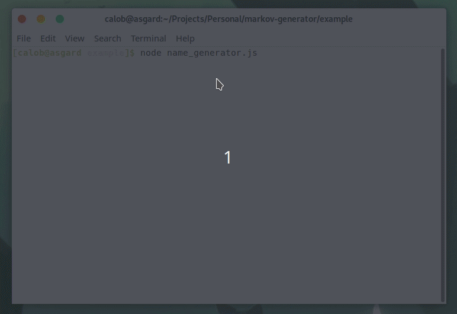

# Markov Generator

> Simple word generator based on markov chains.



## Install

TODO: Upload to package managers, then update this section.  NPM and Yarn

## Usage

```js
const MarkovChain = require('markov-generator');

let MyChain = MarkovChain(['simple', 'list', 'of', 'similar', 'words']);
let ouput = MyChain.generate();
```

## Contribute

PRs accepted.

## License

MIT © Calob Humble 2018
